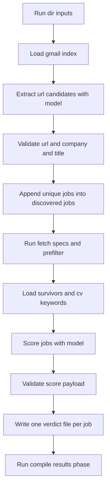

# OpenRouter plan for AI Step 1 and AI Step 2

## Feasibility answer

Yes. With an OpenRouter API key and model path in `.env`, this project can call OpenRouter from Node using native `fetch` in the existing TypeScript runtime and produce the two AI outputs required by the pipeline.

Relevant pipeline touchpoints already exist:

- AI Step 1 and AI Step 2 are explicitly expected by [`runPrePhase()`](src/run-job-search.ts:256) logs in [`src/run-job-search.ts`](src/run-job-search.ts)
- `discover` output contract is consumed by [`main()`](src/02-fetch-specs.ts:590) in [`src/02-fetch-specs.ts`](src/02-fetch-specs.ts)
- scoring verdicts are consumed by [`compileResults()`](src/04-compile-results.ts:121) in [`src/04-compile-results.ts`](src/04-compile-results.ts)

## Important compatibility notes

1. Current Gmail index written by [`downloadGmailEmails()`](src/01-discover.ts:506) is an array of metadata entries in `emails/index.json`, while your requested AI input contract is `emails/gmail/index.json` with `emails` entries including `bodyText`.
2. Current dedupe behavior in [`deduplicateByUrl()`](src/01-discover.ts:668) is lowercasing and dropping query string only.
3. Current prefilter output is an array at root in [`main()`](src/03-prefilter.ts:256), not an object wrapper.
4. Current score file lookup in [`findVerdictFile()`](src/04-compile-results.ts:63) matches by company slug, which can be ambiguous if there are multiple roles from the same company.

## Proposed architecture

### New AI module layout

- `src/ai/openrouter-client.ts`
  - wraps OpenRouter chat completion calls
  - env driven keys and model
  - request retry and structured error mapping
- `src/ai/step2-extract-from-gmail.ts`
  - reads `RUN_DIR/emails/gmail/index.json`
  - supports fallback parsing for current on disk shape when needed
  - extracts company URL title pairs via model
  - appends only new jobs to `RUN_DIR/discovered-jobs.json`
- `src/ai/step4-score-survivors.ts`
  - reads `RUN_DIR/pre-filter-survivors.json`
  - reads management file `jobs/cv-keywords.md`
  - scores each survivor and writes one verdict JSON per job in `RUN_DIR/job-scores`
- `src/ai/validators.ts`
  - deterministic schema guards for model output
  - URL and score range validation

### Environment variables

Add to [`.env.example`](.env.example):

- `OPENROUTER_API_KEY=`
- `OPENROUTER_MODEL=`
- `OPENROUTER_BASE_URL=https://openrouter.ai/api/v1`
- `OPENROUTER_HTTP_REFERER=` optional
- `OPENROUTER_TITLE=job-harvester` optional
- `OPENROUTER_TIMEOUT_MS=90000` optional
- `OPENROUTER_MAX_RETRIES=2` optional

### Data flow

## Step 1 design details: extract jobs from Gmail index

### Input handling

- Primary input: `RUN_DIR/emails/gmail/index.json`
- Accept both shapes
  - requested wrapper `{ emails: [...] }`
  - fallback array `[...]`
- For fallback entries without `bodyText`, load body from referenced email text files when available

### Model prompt strategy

- Send bounded chunks per email to avoid token spikes
- Request strict JSON only
- Required extracted fields per candidate
  - `company`
  - `title` if detectable else fallback `Unknown role`
  - `url`
- Instruct model to exclude non job links like tracking unsubscribe and image links, plus generic company references that are not specific roles.

### Deterministic post processing

- Parse JSON with strict guards
- Normalize URL
  - lowercase host
  - strip query and hash
  - strip trailing slash
- Keep only valid http and https URLs
- Build IDs as `gmail-YYYY-MM-DD-companySlug-seq`
- Append to existing `jobs` array in `discovered-jobs.json` and keep all existing top level fields intact
- Skip duplicates by normalized URL against existing entries and within current extraction batch

## Step 2 design details: score survivors

### Input handling

- Read `RUN_DIR/pre-filter-survivors.json` as array
- Read `jobs/cv-keywords.md` from management data location
- Ensure `RUN_DIR/job-scores` exists

### Scoring model contract

For each survivor, request JSON object with:

- `jobId`
- `company`
- `title`
- `url`
- `score` integer 0 to 10
- `reasoning`
- optional `verdict` `PASS` `REVIEW` `REJECT`
- optional `match_reasons` array
- optional `concerns` array
- optional `red_flags` array
- optional `summary`

### Deterministic scoring guards

- Clamp score to 0 to 10
- If model omits verdict compute with thresholds
  - PASS for 7 to 10
  - REVIEW for 4 to 6
  - REJECT for 0 to 3
- Reject malformed payload and write safe fallback verdict with low score plus explicit reasoning

### File naming strategy

- Use date plus company slug and jobId slug to avoid collisions
- Example: `2026-02-23-acme-gmail-2026-02-23-acme-1.json`

## Reliability and safety

- Retries with backoff on transient HTTP and 429
- Timeout per request
- Batch size limits for survivors to control prompt size
- PII minimization in prompt payloads
- Full audit logs in run dir
  - `ai-step2-log.json`
  - `ai-step4-log.json`

## Implementation task list for code mode

- Add OpenRouter env config entries in [`.env.example`](.env.example)
- Implement OpenRouter client in `src/ai/openrouter-client.ts`
- Implement shared validators in `src/ai/validators.ts`
- Implement AI Step 1 script `src/ai/step2-extract-from-gmail.ts`
- Implement AI Step 2 script `src/ai/step4-score-survivors.ts`
- Add URL normalization utility reuse path to reduce drift with [`normalizeUrl()`](src/03-prefilter.ts:64)
- Add script commands to [`package.json`](package.json)
- Add unit tests for validators and transformation logic under [`src/__tests__`](src/__tests__)
- Add integration style tests for
  - append without overwrite behavior
  - duplicate URL skipping
  - score file generation per survivor
  - threshold mapping PASS REVIEW REJECT
- Add operator docs to [`README.md`](README.md) with exact run commands and expected files

## Suggested CLI usage after implementation

1. Run pre phase
2. Run AI extract
3. Run fetch and prefilter if needed
4. Run AI scoring
5. Run post phase

Example commands:

- `npx ts-node src/run-job-search.ts --phase pre --env-file .env`
- `npx ts-node src/ai/step2-extract-from-gmail.ts --run-dir <RUN_DIR> --env-file .env`
- `npx ts-node src/02-fetch-specs.ts --env-file .env`
- `npx ts-node src/03-prefilter.ts --env-file .env`
- `npx ts-node src/ai/step4-score-survivors.ts --run-dir <RUN_DIR> --env-file .env`
- `npx ts-node src/run-job-search.ts --phase post --run-dir <RUN_DIR> --env-file .env`

## Open questions to confirm before coding

- Should AI Step 1 be embedded into [`01-discover.ts`](src/01-discover.ts) or remain a separate operator invoked script
- Should we update [`findVerdictFile()`](src/04-compile-results.ts:63) to map verdicts by `jobId` first to prevent same company collision
- Should hard fail occur when `jobs/cv-keywords.md` is missing, or fallback to conservative REVIEW defaults

