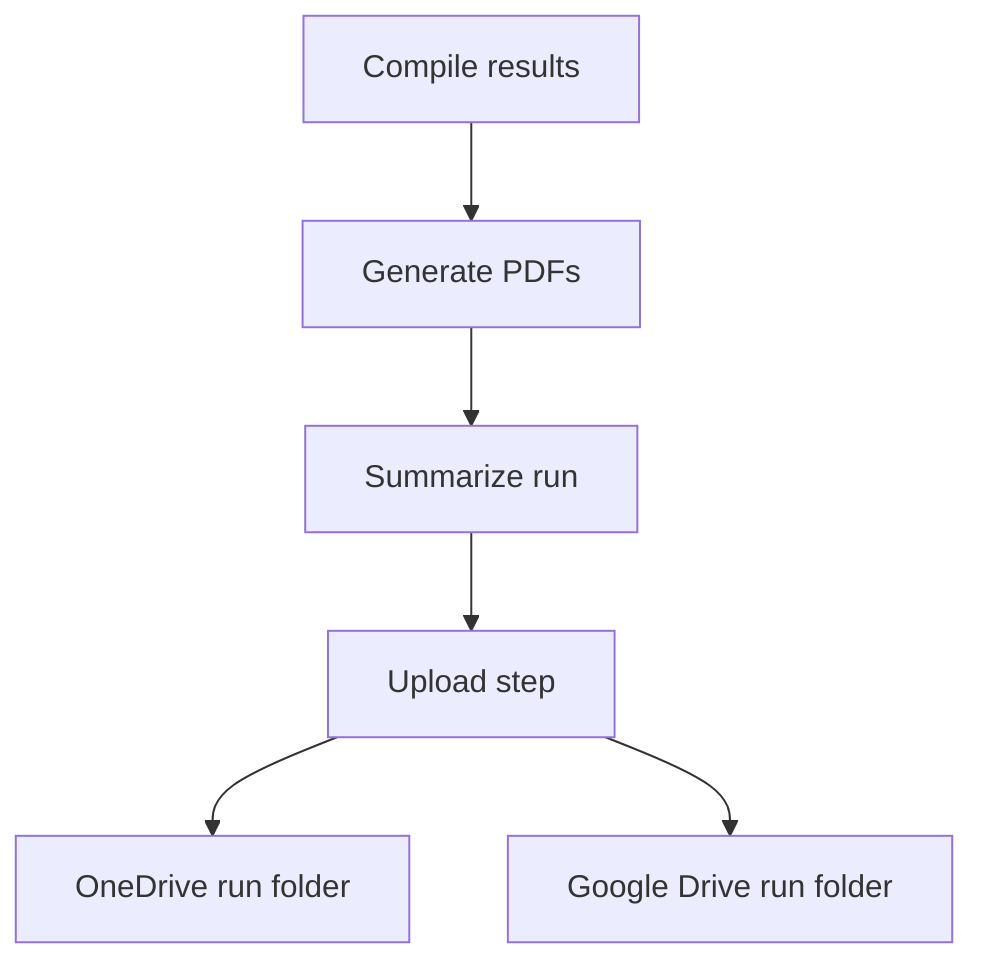

# Post-phase enhancements plan

## Goals

1. Update PDF file naming to include date, score, company, and advert suffix for both PASS and REVIEW jobs.
2. Keep one unique local run folder for the whole run and upload into cloud subfolders named archive with the same timestamp.
3. Add a new summary step before upload that writes:
   - A short human-readable run summary log
   - A detailed human-readable review list
4. Use AI to produce natural narrative when OpenRouter is available, with deterministic fallback text when unavailable.

## Run folder lifecycle and propagation

- Local run folder is created once at pipeline start and kept for all stages:
  - `run-YYYY-MM-DD-HH-mm-ss`
- The same run folder is used end to end for discover, fetch, prefilter, score, compile, pdf, summarize, and upload.
- Cloud archive folder name is derived from local run folder timestamp:
  - `archive-YYYY-MM-DD-HH-mm-ss`
- Propagation approach:
  - orchestrator sets `JOB_HARVESTER_WORK_DIR` before each stage
  - upload and summary derive run timestamp from local run folder basename when needed
  - for split invocations, post phase still accepts `--run-dir` and can additionally support resolving latest run pointer in follow-up iteration if desired

## Proposed output contracts

### PDF names

- New pattern for all generated job PDFs:
  - `YYYY-MM-DD-S{score}-{company-slug}-advert.pdf`
- Examples:
  - `2026-02-23-S8-1password-advert.pdf`
  - `2026-02-23-S5-gitlab-advert.pdf`

No REVIEW prefix; score communicates ranking.

### Summary step outputs

Create a new run-local folder and files:

- `run-summary/summary-log.txt`
- `run-summary/review-jobs.txt`
- optional metadata file for diagnostics
  - `run-summary/summary-meta.json`

### Upload destination structure

Use run timestamp based folder name, e.g. `run-2026-02-23-22-35-10`.

- OneDrive root path:
  - `JobSpecs/archive-{run-timestamp}/...`
- Google Drive root folder:
  - a created subfolder under `GOOGLE_DRIVE_FOLDER_ID`
  - name `archive-{run-timestamp}`
  - upload PDFs and summary text files into that subfolder

## New pipeline step

Add a new deterministic stage before upload:

- `07-summarize-run.ts`

Run order for post phase:

1. compile
2. generate pdfs
3. summarize run
4. upload

## Data sources for summary step

Primary inputs from run dir:

- `discovered-jobs.json`
- `fetched-specs.json`
- `pre-filter-survivors.json`
- `pre-filter-rejections.json`
- `compile-results.json`
- `all-rejections.json`
- `pdfs/pdf-results.json`
- optional `job-scores` stats from directory count

Derived metrics:

- jobs discovered
- jobs fetched successfully
- survivors count
- pre-filter rejected count
- pass count
- review count
- ai rejected count
- pdf generated count

## AI narrative strategy

Summary step behavior:

1. Build deterministic structured facts object.
2. If OpenRouter config is present, request narrative polish for:
   - short summary log
   - review list prose header
3. If OpenRouter call fails or config missing, emit deterministic text templates.
4. Always persist deterministic review rows including:
   - score
   - company
   - title
   - url

## Review list file format

`review-jobs.txt` layout:

- heading
- one line per scoreworthy job
- include PASS and REVIEW by default
- descending score then company sort

Line format:

- `S8 | 1Password | Senior Executive Assistant CTO | https://...`

## Upload behavior changes

### OneDrive

- Keep spec uploads and existing JSON uploads.
- Add summary text files upload into `archive-{run-timestamp}` subfolder.

### Google Drive

- Create `archive-{run-timestamp}` subfolder under configured root once per run.
- Upload PDFs into this subfolder.
- Upload summary text files into this subfolder.
- Persist subfolder id and links in upload output metadata.

## Type and file contract additions

Add summary types and upload metadata extensions:

- summary output model for generated files and stats
- upload output fields for run folder name and cloud folder ids

## Test plan

1. Update PDF filename unit tests for score based names.
2. Add summary step tests for:
   - deterministic generation
   - AI success path
   - AI fallback path
   - review list content ordering
3. Update upload tests for:
   - run subfolder creation behavior
   - summary files included in upload sets
4. Update orchestrator tests for:
   - new stage in manifest and run order
5. Update pipeline e2e expectations for new artifacts.

## Mermaid workflow

## Code mode execution checklist

- Update PDF naming logic and tests.
- Implement new summarize script with AI plus fallback.
- Add summary file references to orchestrator and run manifest.
- Extend upload logic to create and use timestamped run subfolders in both clouds.
- Upload summary files with PDFs.
- Extend types and output JSON schema fields where needed.
- Update README and env docs for the new summary stage behavior.
- Run typecheck and targeted tests then post-phase smoke validation.
