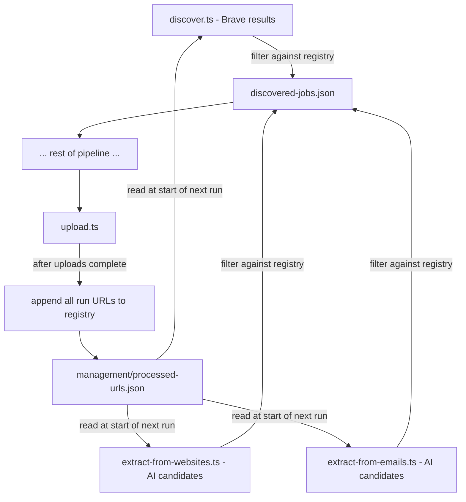
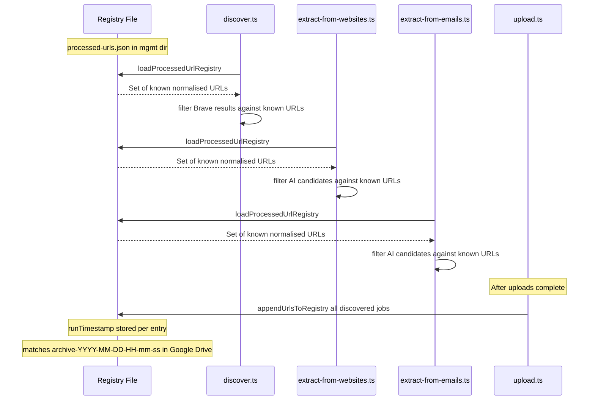

# Plan: Processed-URLs Deduplication Registry

## Goal

Prevent re-processing URLs that have already been handled in previous pipeline runs by maintaining a persistent registry file in the management folder. Three integration points:

1. **Brave search results** — rejected before entering `discovered-jobs.json`
2. **AI-extracted website/email candidates** — filtered before being merged into `discovered-jobs.json`
3. **Upload step** — all URLs from the completed run are appended to the registry after uploads complete

---

## Architecture Overview



---

## Registry File

**Location:** `{JOB_HARVESTER_MANAGEMENT_DATA_DIR}/processed-urls.json`

**Format:**
```json
{
  "version": 1,
  "updatedAt": "2026-02-24T18:00:00.000Z",
  "urls": [
    {
      "url": "https://example.com/jobs/123",
      "normalizedUrl": "https://example.com/jobs/123",
      "recordedAt": "2026-02-24T18:00:00.000Z",
      "runTimestamp": "2026-02-24-18-00-00",
      "source": "brave"
    }
  ]
}
```

**`runTimestamp`** is the `YYYY-MM-DD-HH-mm-ss` portion of the run directory basename (e.g. `run-2026-02-24-18-00-00` → `2026-02-24-18-00-00`). This directly matches the Google Drive archive folder name `archive-2026-02-24-18-00-00`, enabling cross-referencing between the registry and the uploaded archive.

**URL normalisation** reuses the existing `normalizeHttpUrl()` from [`src/ai/validators.ts`](../src/ai/validators.ts) (strips trailing slash, lowercases scheme+host, preserves path). The `Set<string>` of normalised URLs is what is checked at runtime.

---

## Files to Create / Modify

### 1. NEW: `src/utils/processed-urls.ts`

Shared utility module. Exports:

| Export | Signature | Purpose |
|--------|-----------|---------|
| `loadProcessedUrlRegistry` | `(mgmtDir: string) => Promise<Set<string>>` | Reads the JSON file; returns a `Set` of normalised URLs. Returns empty set if file missing. |
| `appendUrlsToRegistry` | `(mgmtDir: string, entries: ProcessedUrlEntry[]) => Promise<void>` | Reads existing file, merges new entries (deduplicating by normalised URL), writes back atomically. |
| `buildProcessedUrlEntries` | `(jobs: DiscoveredJob[], runDir: string) => ProcessedUrlEntry[]` | Converts a list of `DiscoveredJob` objects into registry entries. Extracts `runTimestamp` from the run directory basename. |

Internal type `ProcessedUrlEntry`:
```ts
interface ProcessedUrlEntry {
  url: string;            // original URL
  normalizedUrl: string;  // normalised form used for lookup
  recordedAt: string;     // ISO timestamp
  runTimestamp: string;   // YYYY-MM-DD-HH-mm-ss from run dir basename — matches Google Drive archive folder
  source: string;         // brave | linkedin | brave-extracted | gmail
}
```

Registry file shape:
```ts
interface ProcessedUrlRegistry {
  version: 1;
  updatedAt: string;
  urls: ProcessedUrlEntry[];
}
```

### 2. MODIFY: `src/types.ts`

Add exported types `ProcessedUrlEntry` and `ProcessedUrlRegistry` (mirrors the internal types in the utility, so other modules can import them without a circular dependency).

### 3. MODIFY: `src/discover.ts` — `discoverViaBrave()`

**Where:** After the Brave API results are collected into `jobs[]`, before returning.

**Change:** Accept an optional `knownUrls: Set<string>` parameter (default `new Set()`). After building each `DiscoveredJob`, normalise its URL and skip it if it is in `knownUrls`. Log a count of how many were skipped.

**Caller change in `main()`:** Load the registry via `loadProcessedUrlRegistry(managementDataDir)` and pass the set to `discoverViaBrave()`.

Signature change:
```ts
export async function discoverViaBrave(
  apiKey: string,
  queries: string[],
  knownUrls?: Set<string>   // NEW optional param
): Promise<DiscoveredJob[]>
```

### 4. MODIFY: `src/extract-from-websites.ts` — `mergeWebsiteCandidatesIntoDiscovered()`

**Where:** Inside the candidate loop, before appending a new job.

**Change:** Accept an additional `globalKnownUrls: Set<string>` parameter. Check the candidate's normalised URL against both `existingUrls` (within-run dedup, already present) **and** `globalKnownUrls` (cross-run dedup). Count cross-run rejections separately as `alreadyProcessed`.

**Caller change in `runWebsiteExtraction()`:** Load the registry and pass it in.

Signature change:
```ts
export function mergeWebsiteCandidatesIntoDiscovered(
  existingJobs: DiscoveredJob[],
  candidates: ExtractedJobCandidate[],
  discoveredAt: string,
  globalKnownUrls?: Set<string>   // NEW optional param
): MergeResult
```

`MergeResult` gains a new field: `alreadyProcessed: number`.

### 5. MODIFY: `src/extract-from-emails.ts` — `mergeCandidatesIntoDiscovered()`

Identical pattern to the website extractor above.

Signature change:
```ts
export function mergeCandidatesIntoDiscovered(
  existingJobs: DiscoveredJob[],
  candidates: ExtractedJobCandidate[],
  discoveredAt: string,
  globalKnownUrls?: Set<string>   // NEW optional param
): MergeResult
```

`MergeResult` gains `alreadyProcessed: number`.

### 6. MODIFY: `src/upload.ts` — `main()`

**Where:** After both OneDrive and Google Drive uploads complete (before `process.exit`).

**Change:** Read `discovered-jobs.json` for the run, call `appendUrlsToRegistry()` with all discovered jobs. This records **all** URLs (not just PASS/REVIEW) so that REJECT-scored jobs are also never re-discovered.

The `runTimestamp` is extracted from the run directory basename (e.g. `run-2026-02-24-18-00-00` → `2026-02-24-18-00-00`) and stored in each registry entry, enabling cross-referencing with the Google Drive archive folder `archive-2026-02-24-18-00-00`.

Recording happens even if upload credentials are missing — the run was processed regardless of whether files were uploaded to cloud storage.

---

## Data Flow Diagram



---

## Key Design Decisions

| Decision | Rationale |
|----------|-----------|
| Registry lives in management dir | Consistent with `applied-companies.txt` and `job-search-processed.json` already there |
| JSON format with metadata | Allows future tooling (e.g. manual removal of a URL to re-process it) |
| `runTimestamp` not full `runDir` path | Machine-independent; directly matches Google Drive archive folder name for cross-referencing |
| Normalised URL as the lookup key | Prevents `http` vs `https`, trailing slash, and case differences from causing false misses |
| Optional `knownUrls` param (default empty set) | Keeps all existing tests passing without modification; new tests cover the filtering path |
| Record in `upload.ts` not `summarize-run.ts` | Upload is the last pipeline step; recording here means "this run was fully committed" |
| Record all discovered URLs, not just PASS/REVIEW | Prevents re-discovering jobs that were scored REJECT — they were already evaluated |
| `alreadyProcessed` counter in merge results | Enables logging and future reporting of cross-run dedup savings |

---

## Test Plan

### `src/__tests__/processed-urls.test.ts` (new)
- `loadProcessedUrlRegistry` returns empty set when file missing
- `loadProcessedUrlRegistry` returns correct set from valid JSON
- `appendUrlsToRegistry` creates file when it doesn't exist
- `appendUrlsToRegistry` merges without duplicating existing entries
- `appendUrlsToRegistry` deduplicates by normalised URL
- `buildProcessedUrlEntries` maps `DiscoveredJob[]` correctly, extracting `runTimestamp` from run dir basename

### `src/__tests__/discover.test.ts` (extend)
- `discoverViaBrave` with `knownUrls` set filters out matching URLs
- `discoverViaBrave` with empty `knownUrls` behaves as before

### `src/__tests__/extract-from-websites.test.ts` (extend)
- `mergeWebsiteCandidatesIntoDiscovered` with `globalKnownUrls` skips already-processed URLs
- `alreadyProcessed` count is correct

### `src/__tests__/extract-from-emails.test.ts` (extend)
- `mergeCandidatesIntoDiscovered` with `globalKnownUrls` skips already-processed URLs
- `alreadyProcessed` count is correct

### `src/__tests__/upload.test.ts` (extend)
- After upload completes, `appendUrlsToRegistry` is called with discovered jobs
- Registry file is written to management dir with correct `runTimestamp`
