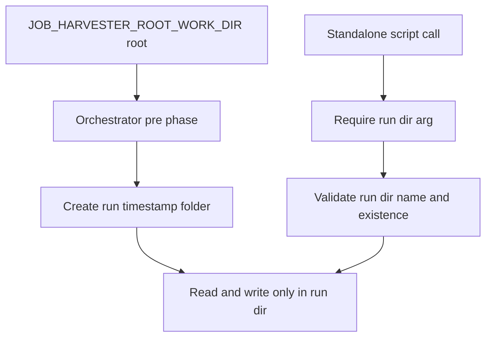

# Run folder enforcement fix plan

## Problem statement

The intended behavior in [post-phase-summary-and-upload-structure-plan.md](plans/post-phase-summary-and-upload-structure-plan.md:12) is one unique run folder per run under the configured root.

Current behavior still allows standalone scripts to write directly into the root from `JOB_HARVESTER_WORK_DIR` when `--run-dir` is omitted, which creates cross-run collisions.

## Confirmed root cause

1. The orchestrator correctly creates a run folder in [createRunDir()](src/run-job-search.ts:95), and passes it stage by stage in [runScript()](src/run-job-search.ts:219).
2. Several standalone scripts still resolve run location from env fallback:
   - [resolveRunDir()](src/ai/step2-extract-from-gmail.ts:69)
   - [resolveRunDir()](src/ai/step4-score-survivors.ts:70)
   - [resolveRunDir()](src/06-summarize-run.ts:45)
   - env-based output root in [resolveDataDir()](src/04-compile-results.ts:30), [resolveDataDir()](src/05-generate-pdfs.ts:20), and [resolveDataDir()](src/07-upload.ts:51)

This mismatch allows accidental writes into the root directory when users run individual scripts without an explicit run dir.

## Confirmed policy decision

Per operator decision:

1. Rename external orchestrator root variable to `JOB_HARVESTER_ROOT_WORK_DIR`.
2. Only orchestrator reads this root variable.
3. All standalone scripts must fail fast unless `--run-dir` is provided and points to a `run-YYYY-MM-DD-HH-mm-ss` directory.

## Target contract

1. `JOB_HARVESTER_ROOT_WORK_DIR` is treated as root workspace only.
2. Active run directory must be explicit in standalone execution via `--run-dir`.
3. Every standalone script validates that:
   - path exists
   - basename matches `run-YYYY-MM-DD-HH-mm-ss`
4. Orchestrator remains the only component that may create new run folders automatically in [createRunDir()](src/run-job-search.ts:95).
5. Post and all phases continue to operate with explicit run dir semantics in [main()](src/run-job-search.ts:318).

## Clarified contract for JOB_HARVESTER_ROOT_WORK_DIR vs --run-dir

- `--run-dir` is the only run-location input for standalone stage entrypoints.
- Standalone scripts do not read `JOB_HARVESTER_ROOT_WORK_DIR` and do not read `JOB_HARVESTER_WORK_DIR`.
- Orchestrator reads `JOB_HARVESTER_ROOT_WORK_DIR`, creates a run folder, and passes the concrete run path.
- Internal stage path helpers are refactored to accept `runDir` explicitly instead of reading env.

This removes dual-source ambiguity from the external contract and internal execution path.

## Implementation plan

### 1. Add shared run-dir guard utility

Create a new utility module:

- [src/utils/run-dir.ts](src/utils/run-dir.ts)

Export helpers:

- `parseRunDirArg(args)`
- `assertValidRunDirName(runDir)`
- `requireExistingRunDir(runDir)`
- `resolveRequiredRunDirFromCli(args)`

Also add root helper:

- `resolveRootWorkDirFromEnv()` reading only `JOB_HARVESTER_ROOT_WORK_DIR` for orchestrator use

Validation rules:

- basename must match `^run-\d{4}-\d{2}-\d{2}-\d{2}-\d{2}-\d{2}$`
- run dir must exist and be a directory
- error text must include actionable fix with `--run-dir`

### 2. Apply guard to standalone scripts

Update standalone scripts to require `--run-dir`, stop env fallback for run context, and pass `runDir` explicitly to internals:

- [main()](src/ai/step2-extract-from-gmail.ts:494)
- [main()](src/ai/step4-score-survivors.ts:363)
- [main()](src/04-compile-results.ts:270)
- [main()](src/05-generate-pdfs.ts:198)
- [main()](src/06-summarize-run.ts:209)
- [main()](src/07-upload.ts:346)

Expected behavior:

- if `--run-dir` missing: fail fast
- if `--run-dir` invalid format: fail fast
- if `--run-dir` missing on disk: fail fast
- no standalone stage reads `JOB_HARVESTER_ROOT_WORK_DIR`
- no standalone stage reads `JOB_HARVESTER_WORK_DIR`

### 3. Update orchestrator root variable and keep semantics

In [parseArgs()](src/run-job-search.ts:55) and [main()](src/run-job-search.ts:318):

- read root only from `JOB_HARVESTER_ROOT_WORK_DIR`
- keep pre phase creating a run folder under configured root
- keep post requiring `--run-dir`
- require `--run-dir` for all phase or auto-create then run post only if explicitly intended
- validate run-dir naming for post and all before execution

Migration behavior:

- if only `JOB_HARVESTER_WORK_DIR` is present, fail with explicit rename guidance to `JOB_HARVESTER_ROOT_WORK_DIR`

### 4. Update command and docs contract

Update script usage docs to explicitly require `--run-dir` for standalone scripts that operate on run artifacts, and rename root env var:

- [README.md](README.md:103)
- [TESTING.md](TESTING.md:20)

Document that root env path is not a run path and should not be used directly as a run dir.
Document env rename from `JOB_HARVESTER_WORK_DIR` to `JOB_HARVESTER_ROOT_WORK_DIR`.

### 5. Regression tests

Add and update tests:

- [src/__tests__/run-job-search.test.ts](src/__tests__/run-job-search.test.ts:32)
  - validate run-dir name checks for post and all
  - validate root env uses `JOB_HARVESTER_ROOT_WORK_DIR`
  - validate migration error when old var is used
- New test file for utility parser and validator
  - [src/__tests__/run-dir-utils.test.ts](src/__tests__/run-dir-utils.test.ts)
- Standalone script tests:
  - fail when `--run-dir` missing
  - fail when `--run-dir` invalid
  - pass with valid run dir
- Keep existing coverage for orchestrated path rooted in `JOB_HARVESTER_ROOT_WORK_DIR`.

## Mermaid flow

## Implementation checklist for Code mode

- Add [src/utils/run-dir.ts](src/utils/run-dir.ts)
- Rename root env usage to `JOB_HARVESTER_ROOT_WORK_DIR` in orchestrator only
- Integrate run-dir guard into all standalone run scripts
- Remove env-based run resolution from standalone internals and entrypoints
- Keep orchestrator folder creation and explicit run-dir pass-through behavior
- Add and update tests for fail-fast scenarios
- Update [README.md](README.md:103), [.env.example](.env.example), and [TESTING.md](TESTING.md:20) for new env name and standalone requirements
- Run validation: lint, typecheck, build, tests
